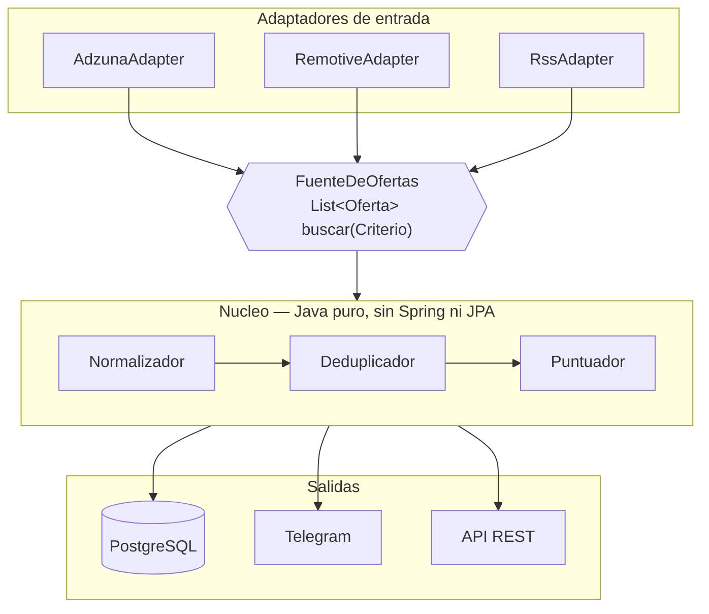

> **Estado: en construccion.** El esqueleto y el nucleo estan en pie; los
> adaptadores marcados con `TODO(fase-N)` aun no. Este README describe el
> proyecto terminado y sirve de guia de lo que falta.

# RedTrack

[](https://github.com/Miguel04MK/RedTrack/actions/workflows/ci.yml)
[](LICENSE)


Cada manana consulta varias APIs publicas de empleo, normaliza las ofertas a un
modelo comun, elimina duplicados, puntua cuanto encaja cada una con mi perfil, y
me manda por Telegram solo las nuevas que superan mi umbral.

<!-- TODO: captura del mensaje de Telegram. No es opcional: es lo primero que
     mira quien abre el repo. -->

---

## El problema

Me presente a mas de treinta ofertas en tres semanas. La mayor parte del tiempo
no se me iba en escribir candidaturas: se me iba en **leer anuncios que no
encajaban**. Los buscadores de los portales filtran mal — InfoJobs empareja mi
"C" con ofertas de "C++" — y no hay forma de decirles "avisame solo de lo que de
verdad me sirve".

RedTrack es esa forma. Yo no vuelvo a abrir un portal: el portal viene a mi, ya
filtrado.

---

## Arquitectura

Puertos y adaptadores. Aqui no es postureo: hay N fuentes con formatos distintos
y el objetivo es poder anadir la sexta sin tocar el nucleo.



```
com.miguelalvarez.redtrack
├── dominio           modelo · puertos · servicios      <- Java puro
├── aplicacion        casos de uso
├── infraestructura   fuentes · persistencia · notificacion · ia · web
└── configuracion     ensamblado
```

**Regla de oro:** el paquete `dominio` no importa nada de Spring, ni de JPA, ni
de Jackson. Sus tests corren en milisegundos porque no levantan contexto.

---

## Como levantarlo

```bash
cp .env.example .env    # y rellenar las claves
docker compose up -d
```

Eso es todo: Postgres, migraciones de Flyway y la aplicacion.

| | |
|---|---|
| API | http://localhost:8080/api/ofertas |
| Swagger | http://localhost:8080/swagger-ui.html |
| Health | http://localhost:8080/actuator/health |

Para desarrollo en Windows, `.\build.ps1` compila y pasa los tests.

---

## Decisiones tecnicas, y por que

### No hay scraping, y es a proposito

No se raspa InfoJobs, LinkedIn ni Tecnoempleo. Tres razones:

1. Sus terminos de uso lo prohiben expresamente.
2. Este repositorio es publico. Un scraper de InfoJobs en el portfolio de alguien
   que se inscribe por InfoJobs es un mal cuadro.
3. Tecnicamente es una cinta de correr: Cloudflare, limites de peticiones, render
   dinamico, muros de login y selectores que se rompen cada semana.

Se usan **APIs publicas y feeds RSS que existen para esto**. Y ademas es mas
interesante: integrar cinco esquemas distintos y unificarlos es un problema de
verdad; raspar HTML no lo es.

### Puertos y adaptadores porque las fuentes son intercambiables

Anadir una fuente es implementar `FuenteDeOfertas` y registrar el bean. El nucleo
no se toca. Si una fuente cae, devuelve lista vacia y las demas siguen.

### La deteccion de tecnologias usa limites de palabra reales

`"Java"` no casa dentro de `"JavaScript"`. `"C"` no casa dentro de `"C++"` ni
`"C#"`. `"Go"` no casa dentro de `"Google"`. Hay **un test por cada caso**, y
estan escritos precisamente porque es el bug que si tiene el buscador de un
portal real.

### La deduplicacion es en dos pasos, con una salvaguarda

1. **Huella exacta:** `sha256(empresa|titulo|ubicacion)` normalizados. Diez lineas
   y pilla la mayoria.
2. **Similitud de Jaro-Winkler** entre titulos, solo cuando empresa y ubicacion
   coinciden.

Y la parte que importa: *"Desarrollador Java Junior"* y *"Desarrollador Java
Senior"* se parecen al **93%**, por encima del umbral. Si solo se mira la
similitud, el sistema fusiona una oferta junior con una senior y pierde la buena.
Por eso, **antes de comparar por similitud, si las senales de seniority difieren
no son la misma oferta**.

### La IA es opcional y degrada con elegancia

El sistema funciona completo sin el modelo. Si Ollama esta disponible, anade un
resumen; si no, se degrada silenciosamente. **Una dependencia externa opcional no
debe poder tumbar el servicio.**

Implementado con dos beans: `OllamaAnalizador` bajo
`@ConditionalOnProperty(radar.ia.activa=true)` y `NuloAnalizador` bajo
`@ConditionalOnMissingBean`. Timeout de 5 segundos: con 30 ofertas, un timeout
largo hace que la tarea diaria no termine nunca.

### Postgres en la instancia, no RDS

RDS es gratis 750 horas el primer ano y luego cuesta. Para este volumen de datos
no aporta nada frente a un contenedor con un volumen persistente en la misma EC2.

### Las banderas rojas informan, no restan

*"Pide 5 anos"* o *"pide ingles C1"* se muestran aparte en vez de bajar la
puntuacion. La maquina informa, yo decido — y asi una oferta buena no cae del
resumen por un "se valora ingles".

---

## Puntuacion

Cuatro bloques que suman 100, multiplicados por la seniority:

```
encaje = (tecnologias + anos + ubicacion + salario) x factorSeniority
```

| Bloque | Puntos | Criterio |
|---|---:|---|
| Tecnologias | 55 | pesos de las pedidas que tengo / pesos de todas las pedidas, ponderado por nivel |
| Anos requeridos | 20 | 0-1 → 20 · 2 → 13 · 3 → 7 · 4+ → 0 · no dice → 13 |
| Ubicacion | 15 | remoto o Galicia 15 · resto de Espana 6 · extranjero 0 |
| Salario | 10 | banda por encima del objetivo 10 · por debajo 4 · sin publicar 6 |

| Seniority | Factor |
|---|---:|
| JUNIOR | ×1.00 |
| No lo dice | ×0.85 |
| MID | ×0.50 |
| SENIOR | ×0.15 |

**Por que la seniority multiplica y no suma.** En el diseno inicial era un bloque
de 20 puntos. Con datos reales, una oferta de *Senior Java Software Engineer*
sacaba **73 sobre 100** y superaba el umbral: mencionaba Java, saturaba el bloque
de tecnologias, y los demas bloques compensaban de sobra el cero de seniority.

Cualquier bloque que suma se puede compensar. Y una oferta senior no es una
oferta un poco peor para un junior: es una oferta que no sirve. Por eso
multiplica.

Ademas, `descartar_si_titulo_contiene` es un filtro duro y manda a cero: el
nombre del ajuste promete descartar. Se mira solo el titulo — "reportaras al
arquitecto" no convierte una oferta junior en una de arquitecto.

El perfil vive en [`perfil.yaml`](src/main/resources/perfil.yaml), fuera del
codigo, para ajustar pesos y umbral sin recompilar.

---

## Stack

Java 21 · Spring Boot 3.4 · **Maven** · Spring Data JPA · PostgreSQL 16 ·
Flyway · Spring RestClient · Jackson · MapStruct · commons-text (Jaro-Winkler) ·
springdoc-openapi · Docker · GitHub Actions · Ollama (opcional)

**Tests:** JUnit 5 · AssertJ · **WireMock** · Testcontainers · JaCoCo

WireMock simula las APIs externas: los tests corren **offline** y en CI, sin
claves y sin depender de que Adzuna este arriba.

---

## Limitaciones conocidas

- La deduplicacion **falla con ofertas de ETT** que reescriben el titulo entero.
  La huella no coincide y la similitud tampoco llega al umbral.
- **El modelo no cabe en la EC2 gratuita.** Una t2.micro tiene 1 GB de RAM: en
  perfil `prod` la IA va desactivada, y no es un olvido.
- Las **fuentes en ingles introducen ruido**: muchas piden un nivel de idioma que
  no tengo. Por eso `Oferta.idioma` existe y el puntuador las trata aparte.
- La deteccion de tecnologias solo reconoce las que estan en `perfil.yaml`. Una
  tecnologia desconocida no aparece ni como pedida ni como bandera roja.
- El bloque de ubicacion aun no distingue "resto de Espana" de "extranjero":
  falta el catalogo de provincias.

---

## v2

- Catalogo de provincias para afinar el bloque de ubicacion.
- Adaptador generico de RSS: N fuentes por el precio de una.
- Despliegue automatico por SSH desde GitHub Actions en cada push a `main`.
- Con un mes de datos reales del mercado junior espanol, dos graficos en este
  README: las 15 tecnologias mas pedidas, y el salario medio junior por
  provincia.

---

## Licencia

[MIT](LICENSE). Usalo, copialo y modificalo con libertad; solo mantén el aviso
de copyright.
