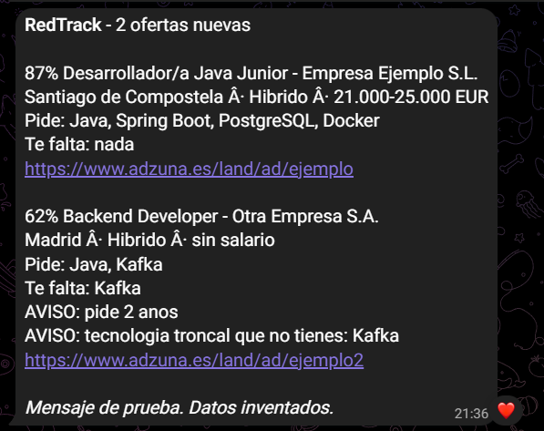
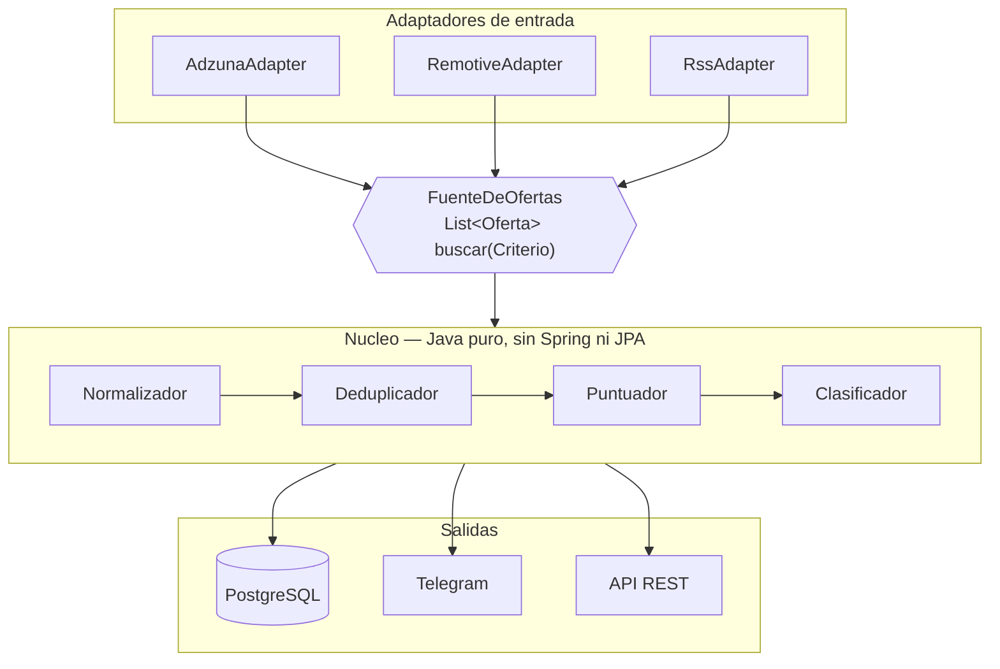
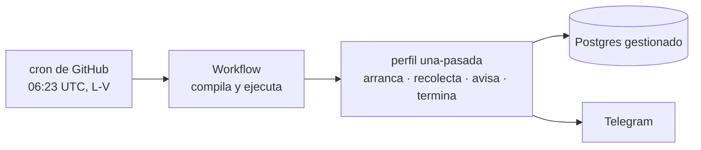

# RedTrack

[](https://github.com/Miguel04MK/RedTrack/actions/workflows/ci.yml)
[](https://github.com/Miguel04MK/RedTrack/actions/workflows/radar.yml)
[](LICENSE)


Cada manana consulta varias APIs publicas de empleo, normaliza las ofertas a un
modelo comun, elimina duplicados, puntua cuanto encaja cada una con mi perfil, y
me manda por Telegram solo las nuevas que superan mi umbral.

**Esta funcionando.** Se ejecuta solo cada manana laborable, sin servidor
encendido y sin que yo toque nada.

<p align="center">
  
  <br>
  <em>El resumen tal y como llega. Datos de ejemplo: empresas y cifras inventadas.</em>
</p>

---

## El problema

Me presente a mas de treinta ofertas en tres semanas. La mayor parte del tiempo
no se me iba en escribir candidaturas: se me iba en **leer anuncios que no
encajaban**.

Los buscadores de los portales filtran mal. El caso que me hizo empezar esto: al
poner "C" entre mis tecnologias, un portal empezo a ofrecerme puestos de "C++",
porque su busqueda no distingue una tecnologia de otra que la contiene. Y no hay
forma de decirle "avisame solo de lo que de verdad me sirve".

RedTrack es esa forma. Yo no vuelvo a abrir un portal: el portal viene a mi, ya
filtrado.

---

## Arquitectura

Puertos y adaptadores. Aqui no es postureo: hay N fuentes con formatos distintos
y el objetivo es poder anadir la sexta sin tocar el nucleo.



```
com.miguelalvarez.redtrack
├── dominio           modelo · puertos · servicios      <- Java puro
├── aplicacion        casos de uso
├── infraestructura   fuentes · persistencia · notificacion · ia · web
└── configuracion     ensamblado
```

**Regla de oro:** el paquete `dominio` no importa nada de Spring, ni de JPA, ni
de Jackson. Sus tests corren en milisegundos porque no levantan contexto.

---

## Como se ejecuta

**No hay servidor encendido.** El trabajo diario dura unos 30 segundos, y pagar
una maquina las 24 horas para eso es la forma equivocada del problema.



El perfil `una-pasada` arranca la aplicacion sin servidor web ni planificador,
hace el trabajo y **se muere**. El nucleo no se entera: mismos casos de uso,
mismos puertos, mismos adaptadores. Lo unico que cambia es quien dispara — antes
un `@Scheduled`, ahora un `ApplicationRunner`. Eso es exactamente lo que compra
la arquitectura de puertos y adaptadores.

El codigo de salida refleja si fue bien, asi que el workflow se pone **en rojo**
cuando el radar falla. Sin eso, un fallo cuyo unico sintoma es *"no me llego un
mensaje"* seria invisible.

### En local

```bash
cp .env.example .env    # y rellenar las claves
docker compose up -d
```

Postgres, migraciones de Flyway y la aplicacion, con un comando.

| | |
|---|---|
| Swagger | http://localhost:8080/swagger-ui.html |
| Health | http://localhost:8080/actuator/health |

En Windows, `.\build.ps1` compila y pasa los tests, y
`.\scripts\arrancar-local.ps1` levanta la aplicacion cargando el `.env`.

---

## La API

| | |
|---|---|
| `GET /api/ofertas` | filtrable por `minEncaje`, `modalidad`, `desde`, `fuente`, `limite` |
| `GET /api/ofertas/{huella}` | una oferta con su analisis completo |
| `POST /api/analizar` | **pega una oferta y analizala entera**, sin guardarla |
| `GET /api/estadisticas` | tecnologias mas pedidas y salario medio por ubicacion |
| `POST /api/recolectar` | dispara una recoleccion · **protegido** |
| `POST /api/resumen` | genera y envia el resumen · **protegido** |

Las ofertas se referencian por su **huella**, no por un id de base de datos: es
una clave natural del dominio y evita exponer la identidad de JPA.

Los dos endpoints que *hacen* cosas van tras un token en cabecera: uno gasta
cuota de la API externa y el otro hace que el bot escriba. Y **fallan cerrado**:
sin token configurado devuelven 503 en vez de quedar abiertos, porque un
despliegue al que se le olvida una variable tiene que romperse de forma evidente,
no quedarse en barra libre.

### `POST /api/analizar` es el endpoint que importa

Es el modo *"pegame esta oferta que acabo de ver"*, y es la respuesta practica a
que la fuente principal recorte las descripciones: para las ofertas que de verdad
interesan, el texto entero lo trae una persona. Acepta HTML y no guarda nada.

```bash
curl -X POST localhost:8080/api/analizar -H 'Content-Type: application/json' \
  -d '{"titulo":"Desarrollador Backend Junior","texto":"<p>Java 21 y Spring Boot...</p>"}'
```

```json
{ "analisis": { "encaje": 69, "senal": "JUNIOR", "anosRequeridos": 1,
                "tecnologiasPedidas": ["Java","Spring Boot","PostgreSQL","Docker"],
                "banderasRojas": ["pide ingles alto (tu nivel: B1)"] },
  "modalidad": "HIBRIDO",
  "aviso": "Sin ubicacion ni salario, esos bloques puntuan en neutro..." }
```

---

## El resumen diario

Un mensaje cada manana laborable, con **dos secciones que responden a preguntas
distintas**:

```
RedTrack - 1 para ti · 1 podrian interesarte

PARA TI

[87%] Desarrollador Java Junior - Empresa Ejemplo S.L.
Ciudad · Hibrido · 21.000-25.000 EUR
Pide: Java, Spring Boot, PostgreSQL
Te falta: nada
https://...

PODRIAN INTERESARTE
Junior de desarrollo, aunque no sea tu stack.

[22%] Fullstack Developer - Otra Empresa S.A.
Remoto · 25.000 EUR
Stack que no tienes: PHP
https://...
```

**Para ti** son las que superan el umbral de encaje: tu stack, y puedes optar.

**Podrian interesarte** son puestos junior de desarrollo del stack que sea.
Existe porque el mercado junior de una tecnologia concreta se seca semanas
enteras — en una semana medida, la fuente principal no tenia **ni una** oferta
junior de Java en la provincia buscada — y **un resumen que nunca llega es
indistinguible de un resumen roto**.

La segunda seccion **no baja el liston** de lo que el sistema considera bueno:
responde a otra pregunta. Por eso ignora el encaje por completo y solo mira si el
puesto es alcanzable. Si mirase el encaje, seria otra vez la primera lista con el
liston mas bajo.

Cuando el stack no es el tuyo, se dice: *"Stack que no tienes: PHP"*. La maquina
informa, la persona decide.

**Los dias en blanco tambien llegan.** Si no entra nada, el mensaje lo dice y
ensena lo mas alto que hubo:

```
RedTrack - hoy nada supera el umbral.
Revisadas 13 ofertas nuevas.

Lo mas alto que hubo:
· [38%] Software Engineer - Empresa Ejemplo S.L.
· [31%] Full Stack Developer - Otra Empresa S.A. (banda salarial de puesto no junior)
```

Un resumen que no llega es **indistinguible de un sistema caido**, y a los tres
dias de silencio dejarias de fiarte de la herramienta. Esto no baja el umbral:
solo cambia lo que se cuenta. Solo se calla cuando no hubo ni una oferta nueva
que evaluar.

---

## Decisiones tecnicas, y por que

### No hay scraping, y es a proposito

No se raspa ningun portal de empleo. Tres razones:

1. Sus terminos de uso lo prohiben expresamente.
2. Este repositorio es publico. Un scraper de un portal en el portfolio de
   alguien que se inscribe por ese mismo portal es un mal cuadro.
3. Tecnicamente es una cinta de correr: proteccion anti-bots, limites de
   peticiones, render dinamico, muros de login y selectores que se rompen cada
   semana.

Se usan **APIs publicas y feeds RSS que existen para esto**. Y ademas es mas
interesante: integrar esquemas distintos y unificarlos es un problema de verdad;
raspar HTML no lo es.

### Ejecutar sin servidor, y no en una maquina encendida

El plan inicial era una instancia pequena en la nube con el servicio arrancado
todo el dia. Al medirlo, el trabajo diario resulto durar **unos 30 segundos**.

Pagar —o mantener— una maquina 24 horas para 30 segundos de trabajo es la forma
equivocada del problema. Un workflow programado hace lo mismo, gratis y sin nada
que administrar.

El precio a pagar, dicho claro: **no hay API publica accesible**. Para ensenar el
Swagger hay que levantarlo en local. A cambio, no hay servidor que parchear,
ni puertos que exponer, ni maquina que se quede encendida por olvido.

### Puertos y adaptadores porque las fuentes son intercambiables

Anadir una fuente es implementar `FuenteDeOfertas` y registrar el bean. El nucleo
no se toca. Si una fuente cae, devuelve lista vacia y las demas siguen.

La segunda fuente lo demostro: entro entera sin tocar ni un caso de uso, y el
modo de ejecucion sin servidor tampoco toco el nucleo.

### La deteccion de tecnologias usa limites de palabra reales

`"Java"` no casa dentro de `"JavaScript"`. `"C"` no casa dentro de `"C++"` ni
`"C#"`. `"Go"` no casa dentro de `"Google"`. Hay **un test por cada caso**, y
estan escritos precisamente porque es el bug que empuja a construir esto.

### La deduplicacion es en dos pasos, con una salvaguarda

1. **Huella exacta:** `sha256(empresa|titulo|ubicacion)` normalizados. Diez lineas
   y pilla la mayoria.
2. **Similitud de Jaro-Winkler** entre titulos, solo cuando empresa y ubicacion
   coinciden.

Y la parte que importa: *"Desarrollador Java Junior"* y *"Desarrollador Java
Senior"* se parecen al **93%**, por encima del umbral. Si solo se mira la
similitud, el sistema fusiona una oferta junior con una senior y pierde la buena.
Por eso, **antes de comparar por similitud, si las senales de seniority difieren
no son la misma oferta**.

### La IA es opcional y degrada con elegancia

El sistema funciona completo sin el modelo. Si Ollama esta disponible, anade un
resumen; si no, se degrada silenciosamente. **Una dependencia externa opcional no
debe poder tumbar el servicio.**

Implementado con dos beans: `OllamaAnalizador` bajo
`@ConditionalOnProperty(redtrack.ia.activa=true)` y `NuloAnalizador` bajo
`@ConditionalOnMissingBean`. Timeout de 5 segundos: con 30 ofertas, un timeout
largo hace que la tarea diaria no termine nunca.

### Los terminos de busqueda son el filtro de categoria

Para la seccion "podrian interesarte" hay que buscar puestos junior de cualquier
stack, y ahi la API devuelve *Junior Territory Manager*, *Comercial Tecnico
Junior* y *Practicas de RRHH*.

Lo evidente seria filtrar por la categoria que la propia API asigna, y
**funciona** — pero es una trampa: **13 de cada 17 ofertas de informatica reales
llegan sin categoria asignada**, asi que filtrar por ella tira el 76% de las
buenas. Precision alta, recall pesimo.

El filtro acaba siendo doble: terminos de busqueda especificos
(`desarrollador junior`, no `junior`) y una comprobacion del titulo con terminos
solo positivos. Nada tan generico como *"tecnico"*, que es el que arrastra la
mayor parte del ruido.

### El perfil publicado es un ejemplo

[`perfil.yaml`](src/main/resources/perfil.yaml) documenta el formato y permite
que el proyecto arranque nada mas clonarlo, pero sus preferencias son
ilustrativas. El real se apunta con `REDTRACK_PERFIL_RUTA` y no se publica: quien
conoce tu suelo salarial antes de sentarse a negociar tiene ventaja.

### Las banderas rojas informan, no restan

*"Pide 5 anos"* o *"pide ingles C1"* se muestran aparte en vez de bajar la
puntuacion. La maquina informa, yo decido — y asi una oferta buena no cae del
resumen por un "se valora ingles".

---

## Puntuacion

El encaje responde a **dos preguntas distintas**, y por eso tiene dos partes:

```
¿cuanto me gusta?      ->  suma
¿tengo alguna opcion?  ->  multiplica

encaje = (tecnologias + ubicacion + salario) x accesibilidad
```

| Bloque | Puntos | Criterio |
|---|---:|---|
| Tecnologias | 65 | pesos de las pedidas que tengo / pesos de todas las pedidas, ponderado por nivel |
| Ubicacion | 20 | remoto o zona deseada 20 · resto del pais 6 · extranjero 0 |
| Salario | 15 | banda por encima del objetivo 15 · por debajo 4 · sin publicar 6 |

```
accesibilidad = factorSeniority x factorAnos x factorSalario
```

| Seniority | Factor | | Anos pedidos | Factor | | Banda vs objetivo | Factor |
|---|---:|---|---|---:|---|---|---:|
| JUNIOR | ×1.00 | | 0-1 | ×1.00 | | hasta 1,6× | ×1.00 |
| No lo dice | ×0.92 | | 2 | ×0.92 | | 1,6-2,0× | ×0.70 |
| MID | ×0.75 | | 3 | ×0.70 | | 2,0-2,5× | ×0.40 |
| SENIOR | ×0.18 | | 4 | ×0.40 | | mas de 2,5× | ×0.20 |
| | | | 5+ | ×0.20 | | no publica | ×1.00 |
| | | | no lo dice | ×0.90 | | | |

**Por que la accesibilidad multiplica y no suma.** En el diseno inicial la
seniority era un bloque de 20 puntos. Con datos reales, una oferta senior sacaba
**73 sobre 100** y superaba el umbral: mencionaba Java, saturaba el bloque de
tecnologias, y los demas bloques compensaban de sobra el cero de seniority.

Cualquier bloque que suma se puede compensar. Y una oferta senior no es una
oferta un poco peor para un junior: es una oferta que no sirve.

**Por que los anos van en el multiplicador y no en un bloque.** Porque la
etiqueta de seniority es un *proxy* de los anos, y a veces se contradicen:
*"mid-level"* con 2 anos es una puerta entornada y *"mid-level"* con 5 es una
puerta cerrada, pero la etiqueta es la misma. Cuando la oferta dice los anos,
mandan los anos. Asi una MID de dos anos con encaje excepcional puede entrar
(0.75 × 0.92 = 0.69) y una de cuatro no entra ni siendo perfecta
(0.75 × 0.40 = 0.30), sin inventar categorias intermedias en el enum.

**Por que el salario esta en los dos lados.** No es un error: son dos preguntas
distintas sobre el mismo dato. Que una oferta pague el triple del objetivo
responde *"si"* a cuanto me gusta y *"no"* a si puedo optar.

Un sueldo muy por encima del objetivo no es una buena noticia para un junior: es
la prueba de que la oferta no es para el. Es un dato de seniority disfrazado de
dato de compensacion. Es un proxy parcial —solo 3 de cada 15 ofertas publican
banda— y no penaliza el silencio.

Ademas, `descartar_si_titulo_contiene` es un filtro duro y manda a cero: el
nombre del ajuste promete descartar. Se mira solo el titulo — "reportaras al
arquitecto" no convierte una oferta junior en una de arquitecto.

---

## Lo que enseñaron los datos reales

Cuatro fallos que los tests no podian ver, porque no eran fallos de logica sino
suposiciones equivocadas sobre como son las ofertas de verdad. Los cuatro
aparecieron al ejecutar el sistema contra las APIs reales, y todos tienen ya su
test de regresion.

**1. Las ofertas senior superaban el umbral.** Una oferta senior sacaba 73 sobre
100: mencionaba Java, saturaba el bloque de tecnologias, y los demas bloques
compensaban de sobra el cero de seniority. De ahi que la accesibilidad pasara a
multiplicar en vez de sumar.

**2. Exigir una tecnologia que no tienes salia gratis.** El denominador del
bloque de tecnologias es la suma de pesos, y las que no se tienen estaban
declaradas con `peso: 0`. Una oferta podia pedir Angular, .NET y Kafka sin que
la nota bajase un punto. El fondo era conceptual: `nivel` y `peso` son ejes
distintos y se estaban mezclando.

**3. Un puesto de soporte a cliente entro en "para ti".** Saco 61 porque
mencionaba JavaScript, era remoto y pedia 2 anos. El filtro de "esto parece
desarrollo" estaba solo en la segunda seccion. Citar una tecnologia que tienes no
convierte una oferta en una oferta de programador.

**4. El salario delataba lo que el titulo callaba.** Una misma empresa publico
dos ofertas con **banda salarial identica**: una decia *"Senior"* en el titulo y
la otra no. Mismo puesto, distinto titular. Sin usar el salario como evidencia de
seniority, la segunda era la unica que superaba el umbral — el resumen tenia un
100% de falsos positivos.

Y una quinta cosa que no era un fallo sino un techo: **la fuente principal recorta
las descripciones a 500 caracteres**. Medido en la misma recoleccion contra las
dos fuentes:

| | descripcion media | con anos detectados |
|---|---:|---:|
| Fuente A (nacional) | 499 car. | 2 de 19 — **11%** |
| Fuente B (remoto) | 4.255 car. | 11 de 14 — **79%** |

Las expresiones regulares de extraccion estaban bien desde el principio. El
problema era el acceso al texto, no la logica — y por eso tampoco lo habria
resuelto un modelo de IA: ningun modelo analiza un texto que no ha recibido.

**Y una leccion de operacion:** la primera ejecucion programada pidio las 06:00
UTC y arranco a las 10:51. Casi cinco horas tarde, porque todo el mundo programa
en la hora en punto y las ejecuciones se encolan. Movido al minuto 23, y
documentado en el propio workflow para que nadie lo devuelva a las 6 en punto
pensando que queda mas limpio.

---

## Stack

Java 21 · Spring Boot 3.4 · **Maven** · Spring Data JPA · PostgreSQL 16 ·
Flyway · Spring RestClient · Jackson · MapStruct · commons-text (Jaro-Winkler) ·
springdoc-openapi · Docker · GitHub Actions · Ollama (opcional)

**Fuentes:** [Adzuna](https://developer.adzuna.com) (mercado nacional, con
salarios) y [Remotive](https://remotive.com/api-documentation) (remoto, con la
descripcion completa). Ambas son APIs publicas y gratuitas.

**Tests:** JUnit 5 · AssertJ · **WireMock** · Testcontainers · JaCoCo

WireMock simula las APIs externas: los tests corren **offline** y en CI, sin
claves y sin depender de que ninguna fuente este arriba.

---

## Limitaciones conocidas

- **La fuente principal recorta las descripciones a 500 caracteres.** Es el techo
  del sistema, y esta medido: sobre 15 ofertas, el minimo son 482 caracteres, el
  maximo 500, y todas acaban en `…`. No es un parametro que falte usar — lo dice
  su documentacion. Consecuencias medidas: la modalidad sale `DESCONOCIDA` en
  **12 de 15** ofertas y los anos requeridos en **13 de 15**. **No se arregla con
  un modelo de IA**: el cuello de botella es el acceso al texto, y seguir el
  enlace para leer el anuncio entero seria scraping. Se arregla con fuentes que
  devuelvan la descripcion completa.
- **No cubre los grandes portales generalistas, y no puede.** Algunos no permiten
  que terceros agreguen sus ofertas, y de otros no consta que se sindiquen. Es la
  consecuencia directa de no hacer scraping, y es una limitacion asumida: esto no
  sustituye a esos portales, quita el trabajo de *leer* lo que si alcanza. Para el
  resto esta `POST /api/analizar`.
- **No hay API publica accesible**: al ejecutarse sin servidor, el Swagger y los
  endpoints solo existen levantandolo en local.
- La deduplicacion **falla con ofertas de ETT** que reescriben el titulo entero.
  La huella no coincide y la similitud tampoco llega al umbral.
- Una misma vacante **sembrada por varios municipios** genera una fila por
  municipio: la huella incluye la ubicacion. Visto en datos reales, con el mismo
  puesto publicado en cuatro localidades distintas.
- El salario como evidencia de seniority es un **proxy parcial**: solo 3 de cada
  15 ofertas publican banda.
- Las **fuentes en ingles introducen ruido**: muchas piden un nivel de idioma que
  no tengo. Por eso `Oferta.idioma` existe y el puntuador las trata aparte.
- La deteccion de tecnologias solo reconoce las que estan en `perfil.yaml`. Una
  tecnologia desconocida no aparece ni como pedida ni como bandera roja.
- El bloque de ubicacion aun no distingue "resto del pais" de "extranjero":
  falta el catalogo de provincias.
- Las ejecuciones programadas **no son puntuales** y se desactivan solas en
  repositorios sin actividad durante 60 dias.

---

## v2

- **Adaptador de correo.** Los portales que no se pueden integrar mandan alertas
  por email si se las pides. Leer tu propio buzon no es scraping: es contenido
  que te han enviado a ti. Un adaptador IMAP que implemente `FuenteDeOfertas`
  daria cobertura de esos portales sin cruzar ninguna linea.
- Aprovechar los parametros de la API que aun no se usan: excluir terminos en la
  propia consulta para no gastar cupo trayendo ofertas senior, mas los campos
  estructurados de tipo y jornada de contrato.
- Catalogo de provincias para afinar el bloque de ubicacion.
- Adaptador generico de RSS: N fuentes por el precio de una.
- Agrupar los criterios por fuente. La fuente de remoto ignora la ubicacion, asi
  que las combinaciones de terminos por ubicaciones le producen llamadas casi
  identicas: 400 ofertas vistas para 14 nuevas. El deduplicador lo absorbe, pero
  es trafico tirado.
- Con un mes de datos acumulados, dos graficos en este README: las tecnologias
  mas pedidas en ofertas junior, y el salario medio por provincia.

---

## Licencia

[MIT](LICENSE). Usalo, copialo y modificalo con libertad; solo manten el aviso
de copyright.
