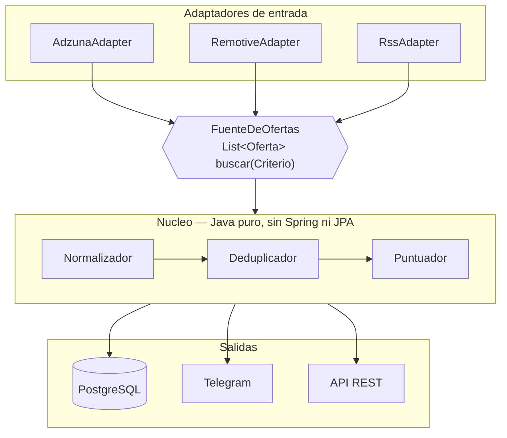

> **Estado: funciona de punta a punta**, con dos fuentes reales, base de datos y
> avisos por Telegram. Falta el despliegue: hoy el resumen diario solo sale si el
> servicio esta levantado. Lo pendiente esta marcado en el codigo como
> `TODO(fase-N)` y resumido en [limitaciones conocidas](#limitaciones-conocidas).

# RedTrack

[](https://github.com/Miguel04MK/RedTrack/actions/workflows/ci.yml)
[](LICENSE)


Cada manana consulta varias APIs publicas de empleo, normaliza las ofertas a un
modelo comun, elimina duplicados, puntua cuanto encaja cada una con mi perfil, y
me manda por Telegram solo las nuevas que superan mi umbral.

<!-- TODO: captura del mensaje de Telegram. No es opcional: es lo primero que
     mira quien abre el repo. -->

---

## El problema

Me presente a mas de treinta ofertas en tres semanas. La mayor parte del tiempo
no se me iba en escribir candidaturas: se me iba en **leer anuncios que no
encajaban**. Los buscadores de los portales filtran mal — InfoJobs empareja mi
"C" con ofertas de "C++" — y no hay forma de decirles "avisame solo de lo que de
verdad me sirve".

RedTrack es esa forma. Yo no vuelvo a abrir un portal: el portal viene a mi, ya
filtrado.

---

## Arquitectura

Puertos y adaptadores. Aqui no es postureo: hay N fuentes con formatos distintos
y el objetivo es poder anadir la sexta sin tocar el nucleo.



```
com.miguelalvarez.redtrack
├── dominio           modelo · puertos · servicios      <- Java puro
├── aplicacion        casos de uso
├── infraestructura   fuentes · persistencia · notificacion · ia · web
└── configuracion     ensamblado
```

**Regla de oro:** el paquete `dominio` no importa nada de Spring, ni de JPA, ni
de Jackson. Sus tests corren en milisegundos porque no levantan contexto.

---

## Como levantarlo

```bash
cp .env.example .env    # y rellenar las claves
docker compose up -d
```

Eso es todo: Postgres, migraciones de Flyway y la aplicacion.

| | |
|---|---|
| Swagger | http://localhost:8080/swagger-ui.html |
| Health | http://localhost:8080/actuator/health |

Para desarrollo en Windows, `.\build.ps1` compila y pasa los tests, y
`.\scripts\arrancar-local.ps1` levanta la aplicacion cargando el `.env`.

### La API

| | |
|---|---|
| `GET /api/ofertas` | filtrable por `minEncaje`, `modalidad`, `desde`, `fuente`, `limite` |
| `GET /api/ofertas/{huella}` | una oferta con su analisis completo |
| `POST /api/analizar` | **pega una oferta y analizala entera**, sin guardarla |
| `GET /api/estadisticas` | tecnologias mas pedidas y salario medio por ubicacion |
| `POST /api/recolectar` | dispara una recoleccion |
| `POST /api/resumen` | genera y envia el resumen sin esperar al cron |

Las ofertas se referencian por su **huella**, no por un id de base de datos: es
una clave natural del dominio y evita exponer la identidad de JPA.

**`POST /api/analizar` es el endpoint que importa.** Es el modo *"pegame esta
oferta que acabo de ver"*, y es la respuesta practica a que Adzuna recorte las
descripciones: para las ofertas que de verdad interesan, el texto entero lo trae
una persona. Acepta HTML y no guarda nada.

```bash
curl -X POST localhost:8080/api/analizar -H 'Content-Type: application/json' \
  -d '{"titulo":"Desarrollador Backend Junior","texto":"<p>Java 21 y Spring Boot...</p>"}'
```

```json
{ "analisis": { "encaje": 69, "senal": "JUNIOR", "anosRequeridos": 1,
                "tecnologiasPedidas": ["Java","Spring Boot","PostgreSQL","Docker"],
                "banderasRojas": ["pide ingles alto (tu nivel: B1)"] },
  "modalidad": "HIBRIDO",
  "aviso": "Sin ubicacion ni salario, esos bloques puntuan en neutro..." }
```

---

## El resumen diario

Un mensaje cada manana laborable a las 8:00, con **dos secciones que responden a
preguntas distintas**:

```
RedTrack - 1 para ti · 3 podrian interesarte

PARA TI

[87%] Desarrollador Java Junior - Coremain
Santiago · Hibrido · 21.000-25.000 EUR
Pide: Java, Spring Boot, PostgreSQL
Te falta: nada
https://...

PODRIAN INTERESARTE
Junior de desarrollo, aunque no sea tu stack.

[22%] Fullstack Developer - 25.000 Al Ano - Remoto - Landra Sistemas
Galicia · Remoto · 25.000 EUR
https://...
```

**Para ti** son las que superan el umbral de encaje: tu stack, y puedes optar.

**Podrian interesarte** son puestos junior de desarrollo del stack que sea.
Existe porque el mercado junior de una tecnologia concreta se seca semanas
enteras — en una semana real, Adzuna no tenia **ni una** oferta junior de Java en
Galicia — y **un resumen que nunca llega es indistinguible de un resumen roto**.

La segunda seccion **no baja el liston** de lo que el sistema considera bueno:
responde a otra pregunta. Por eso ignora el encaje por completo y solo mira si el
puesto es alcanzable. Si mirase el encaje, seria otra vez la primera lista con el
liston mas bajo.

Cuando el stack no es el tuyo, se dice: *"Stack que no tienes: PHP"*. La maquina
informa, la persona decide.

**Los dias en blanco tambien llegan.** Si no entra nada, el mensaje lo dice y
ensena lo mas alto que hubo:

```
RedTrack - hoy nada supera el umbral.
Revisadas 13 ofertas nuevas.

Lo mas alto que hubo:
· [38%] Software Engineer - Mscope
· [31%] Full Stack Java-React - Minsait (banda salarial de puesto no junior)
```

Un resumen que no llega es **indistinguible de un sistema caido**, y a los tres
dias de silencio dejarias de fiarte de la herramienta. Esto no baja el umbral:
solo cambia lo que se cuenta. Solo se calla cuando no hubo ni una oferta nueva
que evaluar.

---

## Decisiones tecnicas, y por que

### No hay scraping, y es a proposito

No se raspa InfoJobs, LinkedIn ni Tecnoempleo. Tres razones:

1. Sus terminos de uso lo prohiben expresamente.
2. Este repositorio es publico. Un scraper de InfoJobs en el portfolio de alguien
   que se inscribe por InfoJobs es un mal cuadro.
3. Tecnicamente es una cinta de correr: Cloudflare, limites de peticiones, render
   dinamico, muros de login y selectores que se rompen cada semana.

Se usan **APIs publicas y feeds RSS que existen para esto**. Y ademas es mas
interesante: integrar cinco esquemas distintos y unificarlos es un problema de
verdad; raspar HTML no lo es.

### Puertos y adaptadores porque las fuentes son intercambiables

Anadir una fuente es implementar `FuenteDeOfertas` y registrar el bean. El nucleo
no se toca. Si una fuente cae, devuelve lista vacia y las demas siguen.

### La deteccion de tecnologias usa limites de palabra reales

`"Java"` no casa dentro de `"JavaScript"`. `"C"` no casa dentro de `"C++"` ni
`"C#"`. `"Go"` no casa dentro de `"Google"`. Hay **un test por cada caso**, y
estan escritos precisamente porque es el bug que si tiene el buscador de un
portal real.

### La deduplicacion es en dos pasos, con una salvaguarda

1. **Huella exacta:** `sha256(empresa|titulo|ubicacion)` normalizados. Diez lineas
   y pilla la mayoria.
2. **Similitud de Jaro-Winkler** entre titulos, solo cuando empresa y ubicacion
   coinciden.

Y la parte que importa: *"Desarrollador Java Junior"* y *"Desarrollador Java
Senior"* se parecen al **93%**, por encima del umbral. Si solo se mira la
similitud, el sistema fusiona una oferta junior con una senior y pierde la buena.
Por eso, **antes de comparar por similitud, si las senales de seniority difieren
no son la misma oferta**.

### La IA es opcional y degrada con elegancia

El sistema funciona completo sin el modelo. Si Ollama esta disponible, anade un
resumen; si no, se degrada silenciosamente. **Una dependencia externa opcional no
debe poder tumbar el servicio.**

Implementado con dos beans: `OllamaAnalizador` bajo
`@ConditionalOnProperty(radar.ia.activa=true)` y `NuloAnalizador` bajo
`@ConditionalOnMissingBean`. Timeout de 5 segundos: con 30 ofertas, un timeout
largo hace que la tarea diaria no termine nunca.

### Los terminos de busqueda son el filtro de categoria

Para la seccion "podrian interesarte" hay que buscar puestos junior de cualquier
stack, y ahi Adzuna devuelve *Junior Territory Manager*, *Comercial Tecnico
Junior* y *Practicas RRHH*.

Lo evidente seria filtrar con el parametro `category=it-jobs`, y **funciona** —
pero es una trampa: **13 de cada 17 ofertas de informatica reales llegan con
`category: unknown`**, asi que filtrar por categoria tira el 76% de las buenas.
Precision alta, recall pesimo.

El filtro acaba siendo doble: terminos de busqueda especificos
(`desarrollador junior`, no `junior`) y una comprobacion del titulo con terminos
solo positivos. Nada tan generico como *"tecnico"*, que es el que arrastra la
mayor parte del ruido. Los tests usan titulos reales devueltos por la API,
odontologos incluidos.

### Postgres en la instancia, no RDS

RDS es gratis 750 horas el primer ano y luego cuesta. Para este volumen de datos
no aporta nada frente a un contenedor con un volumen persistente en la misma EC2.

### Las banderas rojas informan, no restan

*"Pide 5 anos"* o *"pide ingles C1"* se muestran aparte en vez de bajar la
puntuacion. La maquina informa, yo decido — y asi una oferta buena no cae del
resumen por un "se valora ingles".

---

## Puntuacion

El encaje responde a **dos preguntas distintas**, y por eso tiene dos partes:

```
¿cuanto me gusta?      ->  suma
¿tengo alguna opcion?  ->  multiplica

encaje = (tecnologias + ubicacion + salario) x accesibilidad
```

| Bloque | Puntos | Criterio |
|---|---:|---|
| Tecnologias | 65 | pesos de las pedidas que tengo / pesos de todas las pedidas, ponderado por nivel |
| Ubicacion | 20 | remoto o Galicia 20 · resto de Espana 6 · extranjero 0 |
| Salario | 15 | banda por encima del objetivo 15 · por debajo 4 · sin publicar 6 |

```
accesibilidad = factorSeniority x factorAnos x factorSalario
```

| Seniority | Factor | | Anos pedidos | Factor | | Banda vs objetivo | Factor |
|---|---:|---|---|---:|---|---|---:|
| JUNIOR | ×1.00 | | 0-1 | ×1.00 | | hasta 1,6× | ×1.00 |
| No lo dice | ×0.92 | | 2 | ×0.92 | | 1,6-2,0× | ×0.70 |
| MID | ×0.75 | | 3 | ×0.70 | | 2,0-2,5× | ×0.40 |
| SENIOR | ×0.18 | | 4 | ×0.40 | | mas de 2,5× | ×0.20 |
| | | | 5+ | ×0.20 | | no publica | ×1.00 |
| | | | no lo dice | ×0.90 | | | |

**Por que el salario esta en los dos lados.** No es un error: son dos preguntas
distintas sobre el mismo dato. Que una oferta pague 60.000 responde *"si"* a
cuanto me gusta y *"no"* a si puedo optar.

El caso que lo motivo: Minsait publico *"Full Stack Java-React"* con banda
60.000-90.000 y sin la palabra *senior* en el titulo, y *"Senior Full-Stack
Engineer"* con la banda **identica**. Mismo puesto, distinto titular. Sin esta
senal, la primera era la unica oferta que superaba el umbral — el resumen tenia
un 100% de falsos positivos.

Un sueldo muy por encima del objetivo no es una buena noticia para un junior:
es la prueba de que la oferta no es para el. Es un dato de seniority disfrazado
de dato de compensacion. Es un proxy parcial (solo 3 de cada 15 ofertas publican
banda) y no penaliza el silencio.

**Por que la accesibilidad multiplica y no suma.** En el diseno inicial la
seniority era un bloque de 20 puntos. Con datos reales, una oferta de *Senior
Java Software Engineer* sacaba **73 sobre 100** y superaba el umbral: mencionaba
Java, saturaba el bloque de tecnologias, y los demas bloques compensaban de
sobra el cero de seniority.

Cualquier bloque que suma se puede compensar. Y una oferta senior no es una
oferta un poco peor para un junior: es una oferta que no sirve.

**Por que los anos van en el multiplicador y no en un bloque.** Porque la
etiqueta de seniority es un *proxy* de los anos, y a veces se contradicen:
*"mid-level"* con 2 anos es una puerta entornada y *"mid-level"* con 5 es una
puerta cerrada, pero la etiqueta es la misma. Cuando la oferta dice los anos,
mandan los anos. Asi una MID de dos anos con encaje excepcional puede entrar
(0.75 × 0.92 = 0.69) y una de cuatro no entra ni siendo perfecta
(0.75 × 0.40 = 0.30), sin inventar categorias intermedias en el enum.

Ademas, `descartar_si_titulo_contiene` es un filtro duro y manda a cero: el
nombre del ajuste promete descartar. Se mira solo el titulo — "reportaras al
arquitecto" no convierte una oferta junior en una de arquitecto.

El perfil vive en [`perfil.yaml`](src/main/resources/perfil.yaml), fuera del
codigo, para ajustar pesos y umbral sin recompilar.

---

## Lo que enseñaron los datos reales

Tres fallos de diseno que los tests no podian ver, porque no eran fallos de
logica sino suposiciones equivocadas sobre como son las ofertas de verdad. Los
tres aparecieron al ejecutar el sistema contra las APIs reales, y los tres
tienen ya su test de regresion.

**1. Las ofertas senior superaban el umbral.** Una *Senior Java Software
Engineer* sacaba 73 sobre 100: mencionaba Java, saturaba el bloque de
tecnologias, y los demas bloques compensaban de sobra el cero de seniority. De
ahi que la accesibilidad pasara a multiplicar en vez de sumar.

**2. Exigir una tecnologia que no tienes salia gratis.** El denominador del
bloque de tecnologias es la suma de pesos, y las que no se tienen estaban
declaradas con `peso: 0`. Una oferta podia pedir Angular, .NET y Kafka sin que
la nota bajase un punto. El fondo era conceptual: `nivel` y `peso` son ejes
distintos y se estaban mezclando.

**3. Un puesto de soporte a cliente entro en "para ti".** *"SaaS Product Support
Jedi"* saco 61 porque menciona JavaScript, es remota y pide 2 anos. El filtro de
"esto parece desarrollo" estaba solo en la segunda seccion. Citar una tecnologia
que tienes no convierte una oferta en una oferta de programador.

Y una cuarta que no era un fallo sino un techo: **Adzuna recorta las
descripciones a 500 caracteres**. Medido en la misma recoleccion contra las dos
fuentes:

| | descripcion media | con anos detectados |
|---|---:|---:|
| Adzuna | 499 car. | 2 de 19 — **11%** |
| Remotive | 4.255 car. | 11 de 14 — **79%** |

Las expresiones regulares de extraccion estaban bien desde el principio. El
problema era el acceso al texto, no la logica — y por eso tampoco lo habria
resuelto un modelo de IA.

---

## Stack

Java 21 · Spring Boot 3.4 · **Maven** · Spring Data JPA · PostgreSQL 16 ·
Flyway · Spring RestClient · Jackson · MapStruct · commons-text (Jaro-Winkler) ·
springdoc-openapi · Docker · GitHub Actions · Ollama (opcional)

**Fuentes:** [Adzuna](https://developer.adzuna.com) (Espana, con salarios) y
[Remotive](https://remotive.com/api-documentation) (remoto, con la descripcion
completa). Ambas son APIs publicas y gratuitas.

**Tests:** JUnit 5 · AssertJ · **WireMock** · Testcontainers · JaCoCo

WireMock simula las APIs externas: los tests corren **offline** y en CI, sin
claves y sin depender de que Adzuna este arriba.

---

## Limitaciones conocidas

- **Adzuna recorta las descripciones a 500 caracteres.** Es el techo del sistema,
  y esta medido: sobre 15 ofertas reales, el minimo son 482 caracteres, el maximo
  500, y todas acaban en `…`. No es un parametro que falte usar — lo dice su
  documentacion: *"we currently only provide a snipped of the job description"*.
  Consecuencias medidas: la modalidad sale `DESCONOCIDA` en **12 de 15** ofertas,
  los anos requeridos en **13 de 15**, y el detector de tecnologias solo ve las
  que caben en el teaser. **No se arregla con un modelo de IA**: el cuello de
  botella es el acceso al texto, no la capacidad de analizarlo, y seguir el
  `redirect_url` para leer el anuncio entero seria scraping. Se arregla con
  fuentes que devuelvan la descripcion completa.
- La deduplicacion **falla con ofertas de ETT** que reescriben el titulo entero.
  La huella no coincide y la similitud tampoco llega al umbral.
- Una misma vacante **sembrada por varios municipios** genera una fila por
  municipio: la huella incluye la ubicacion. Visto en datos reales, con el mismo
  puesto publicado en Arbo, Chantada, Mos y Pontevedra.
- El salario como evidencia de seniority es un **proxy parcial**: solo 3 de cada
  15 ofertas publican banda.
- **El modelo no cabe en la EC2 gratuita.** Una t2.micro tiene 1 GB de RAM: en
  perfil `prod` la IA va desactivada, y no es un olvido.
- Las **fuentes en ingles introducen ruido**: muchas piden un nivel de idioma que
  no tengo. Por eso `Oferta.idioma` existe y el puntuador las trata aparte.
- La deteccion de tecnologias solo reconoce las que estan en `perfil.yaml`. Una
  tecnologia desconocida no aparece ni como pedida ni como bandera roja.
- El bloque de ubicacion aun no distingue "resto de Espana" de "extranjero":
  falta el catalogo de provincias.

---

## v2

- **Fuentes con la descripcion completa** (Remotive, Arbeitnow, Jobicy). Es lo
  que destapona el proyecto: con el texto entero, la deteccion de tecnologias y
  la extraccion de anos empiezan a funcionar de verdad, y ahi si tiene sentido
  meter un modelo. Todo lo demas son parches inteligentes alrededor de un agujero
  de informacion.
- Aprovechar los parametros de Adzuna que aun no se usan: `what_exclude` para no
  gastar el cupo de resultados trayendo ofertas senior, mas `contract_time` y
  `contract_type`, que son datos estructurados y fiables.
- Catalogo de provincias para afinar el bloque de ubicacion.
- Adaptador generico de RSS: N fuentes por el precio de una.
- Despliegue automatico por SSH desde GitHub Actions en cada push a `main`.
- Con un mes de datos reales del mercado junior espanol, dos graficos en este
  README: las 15 tecnologias mas pedidas, y el salario medio junior por
  provincia.

---

## Licencia

[MIT](LICENSE). Usalo, copialo y modificalo con libertad; solo mantén el aviso
de copyright.
